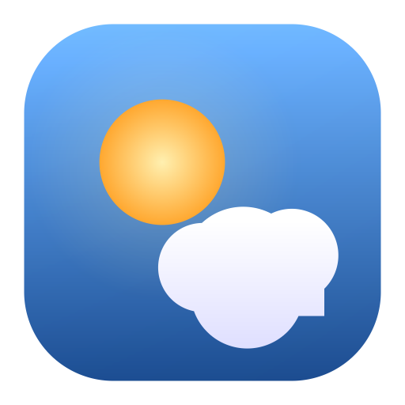

# 🦊 Wetterfux

**Deine professionelle Wetter-App – kostenlos, für die ganze Familie.**

Wetterfux bietet Funktionen, die andere Apps hinter einer Bezahlschranke verstecken –
komplett gratis, ohne Werbung, ohne Konto, ohne Tracking. Läuft als installierbare
Web-App (PWA) auf Handy, Tablet und Desktop.



---

## ✨ Funktionen

Die App ist in **vier wischbare Bereiche** gegliedert – **Heute**, **Verlauf**,
**Gesundheit** und **Familie** – mit Tab-Leiste unten auf dem Handy und einem
Kachel-Dashboard auf dem Desktop.

| Kategorie | Was drin ist |
|-----------|--------------|
| **Aktuell** | Temperatur, gefühlte Temperatur, Höchst-/Tiefstwerte, animiertes Wettersymbol |
| **Vorhersage** | **48 h stündlich** mit Temperaturkurve · **14-Tage-Trend** mit Min/Max-Balken · **Nächste 6 Stunden** im Detail |
| **🌧️ RegenRadar (live)** | Echte Karte, auf der Regenwolken heranziehen – Play/Pause & Zeitleiste (Vergangenheit + Vorhersage) |
| **Regen-Nowcast** | „Regen in X Minuten" auf 15-Minuten-Basis (nächste 2 h) |
| **⚠️ Amtliche Warnungen** | Offizielle **DWD**-Unwetterwarnungen mit Warnstufen, **aufklappbarem Volltext + Verhaltenshinweis**, Gültigkeitsfenster und Kennzeichnung aktiver bzw. bevorstehender Warnungen |
| **🔎 Präzise Suche** | Städte **und Stadtteile, Adressen & Postleitzahlen** – auf genaue Koordinaten, mit Standort-Bevorzugung |
| **👪 Familien-Wetter** | Alle gespeicherten Orte mit Live-Temperatur auf einen Blick, wärmster/trockenster markiert |
| **📸 Ansichten als Bild teilen** | Erzeugt hübsche Wetter-Bildkarten für WhatsApp & Co. – Regen 2 h, nächste 6 h, Wochenende, 14 Tage, Kleidungstipp, Familie, Wetter jetzt. Jede Karte trägt einen **QR-Code**, der die App beim selben Ort öffnet |
| **🗓️ Wochenende** | Samstag + Sonntag auf einen Blick, teilbar als Bild |
| **📸 Wetter-Moment** | Ein kuratierter Tages-Hook (Grillwetter, Goldene Stunde, Frostnacht, Hitze …) |
| **🎨 10 Designs** | Aurora, Midnight, Nebula, Forest, Mono, Matrix, Bitcoin, Daylight, Sand, Mist – beim ersten Start wählbar |
| **🦊 Personalisierung** | Fuchs-Maskottchen im Outfit, Kälteempfinden-Regler, Profile (z. B. Kind/Fahrrad) |
| **🦊 Frag Wetterfux** | Saisonale Schnellantworten: Schirm? Jacke? Sonnencreme? |
| **🕒 Beste Zeit heute** | Optimale Zeitfenster für Draußensein, Sport/Joggen und Wäschetrocknen |
| **✅ Aktivitäts-Check** | Ampel für Grillen, Radfahren, Baden, Schnee, Garten, Fotografieren (saisonal passend) |
| **⚖️ Orte vergleichen** | Gespeicherte Orte nebeneinander mit Markierung des wärmsten/trockensten |
| **🧥 Kleidungstipp** | Konkrete Empfehlung aus Temperatur, Regen, Wind, UV, Glätte & Tag/Nacht-Schwankung |
| **🧪 Biowetter & Gesundheit** | Aufklappbare Faktoren mit **Hinweis + Lerntipp**: Luftdruck-Tendenz, Kopfschmerz-/Migräne-Reiz, Kreislauf, Schwüle, Erkältungsreiz, Temperaturschwankung, Wind/Föhn, UV, Luftqualität, Pollen, Gelenke/Rheuma, Atemwege, Schlaf/Tropennacht – verantwortungsvoll formuliert |
| **🩺 Symptom-Tagebuch** | Persönliches Logbuch (z. B. Kopfschmerz) mit Bezug zum Luftdruck – erkenne deine eigenen Muster; dazu eine Tage-Serie zur Motivation |
| **🌇 Sonnenuntergangs-Himmel** | Goldene & Blaue Stunde (breitengrad-genau), ein „Wie schön wird der Sonnenuntergang?"-Score und seltene Phänomene (feuriger Cirrus, Erdschatten/Venusgürtel, Halo, Regenbogen-Chance, Vollmond …) – jeweils mit Lerntipp |
| **Luftqualität** | Europäischer Luftqualitätsindex (AQI), PM2.5, PM10, Ozon, NO₂ |
| **Pollen** | Gräser, Birke, Erle, Ambrosia, Beifuß, Olive |
| **Sonne & Mond** | Sonnenauf-/untergang mit Tagesbogen, Tageslänge, Mondphase, Goldene-Stunde-Kalendereintrag |
| **Details** | UV-Index mit Empfehlung, Taupunkt, Luftfeuchte, Luftdruck, Sicht, Wind-Kompass |
| **Komfort** | Mehrere Orte speichern · GPS-Standort · Suche · °C/°F · km/h/mph/m/s · DE/EN · Hell/Dunkel |
| **📲 App** | Installierbar (Startbildschirm) · offline-fähig · Pull-to-Refresh · Update-Hinweis · freundliches Onboarding |

Die Oberfläche passt Farben und Animationen dynamisch ans Wetter und die Tageszeit an
(Sonnenstrahlen, ziehende Wolken, Regen, Schnee, Sternenhimmel bei Nacht).

> **Besser als klassische Wetter-Apps:** Familien-Dashboard, personalisierter Kleidungstipp,
> „Beste Zeit heute", Biowetter mit Symptom-Tagebuch und die Sonnenuntergangs-Vorhersage gibt
> es so in den meisten kostenlosen Apps nicht – hier alles gratis und werbefrei.

---

## 📊 Datenquelle

Alle Daten stammen aus kostenlosen, offenen Diensten **ohne API-Schlüssel** und ohne Nutzer-Tracking:

- [**Open-Meteo**](https://open-meteo.com/) – Wetter, Vorhersage, Luftqualität, Pollen
- [**Photon**](https://photon.komoot.io/) – Orts-, Adress- und PLZ-Suche (OpenStreetMap-Geocoding)
- [**RainViewer**](https://www.rainviewer.com/) – Radar-Kacheln fürs animierte RegenRadar
- [**Bright Sky**](https://brightsky.dev/) – amtliche **DWD**-Unwetterwarnungen (DE/AT)
- [**OpenStreetMap**](https://www.openstreetmap.org/) – Kartenhintergrund (via [Leaflet](https://leafletjs.com/), lokal eingebunden)
- [**BigDataCloud**](https://www.bigdatacloud.com/) – Reverse-Geocoding (Koordinaten → Ortsname)

Es entstehen **keine Kosten** – weder für dich noch für deine Familie.

---

## 🚀 So veröffentlichst du die App (einmalig)

Damit deine Familie die App über einen Link öffnen und installieren kann, wird sie über
**GitHub Pages** bereitgestellt – gratis.

1. Änderungen in den Standard-Branch (`main`) mergen.
2. Im Repository: **Settings → Pages → Build and deployment → Source: „GitHub Actions"** wählen.
3. Der enthaltene Workflow (`.github/workflows/deploy.yml`) veröffentlicht die App automatisch.
4. Nach ~1 Minute ist sie erreichbar unter:

   ```
   https://<dein-benutzername>.github.io/<repo-name>/
   ```

Diesen Link schickst du an deine Familie. 🎉

### Auf dem Handy installieren
- **iPhone (Safari):** Teilen-Symbol → „Zum Home-Bildschirm".
- **Android (Chrome):** Menü ⋮ → „App installieren" / „Zum Startbildschirm hinzufügen".

Danach startet Wetterfux wie eine echte App – im Vollbild, mit eigenem Icon, offline-fähig.
Mehr Details (inkl. optionaler `.apk`) in [`ANDROID.md`](ANDROID.md).

---

## 🔗 Teilen

- **Ort als Link:** In der App auf **↗ Teilen** tippen. Der Link enthält den gewählten Ort
  (z. B. `…/?lat=52.52&lon=13.40&name=Berlin`) – wer ihn öffnet, sieht sofort das passende Wetter.
- **Ansicht als Bild:** Über das kleine **↗**-Symbol an den Karten wird die jeweilige Ansicht als
  hübsches Bild fürs Weiterleiten erzeugt (mit QR-Code zurück zur App).

Gespeicherte Orte, Einstellungen und Tagebuch liegen ausschließlich lokal im Browser jedes Geräts.

---

## 🛠️ Lokal ausprobieren

Die App ist reines HTML/CSS/JavaScript – **kein Build-Schritt nötig**. Einfach einen kleinen
Webserver im Projektordner starten (für ES-Module/Service-Worker wird `http://` benötigt,
`file://` reicht nicht):

```bash
python3 -m http.server 8000
# dann http://localhost:8000 im Browser öffnen
```

---

## 📁 Projektstruktur

```
index.html               App-Grundgerüst (4 Seiten + Tab-Leiste)
manifest.webmanifest     PWA-Manifest (Installierbarkeit)
sw.js                    Service Worker (Offline-Cache)
css/style.css            Design, Animationen, dynamische Himmel-Verläufe
js/
  app.js                 Steuerung: Standort, Suche, Orte, Tabs, Teilen, Einstellungen
  api.js                 Wetter-, Luftqualitäts- & Geocoding-Anbindung
  ui.js                  Rendern aller Karten
  radar.js               Animiertes RegenRadar (Leaflet + RainViewer)
  advice.js              Kleidungstipp-Logik
  moment.js              „Wetter-Moment des Tages"
  journal.js             Symptom-Tagebuch & Auswertung
  skyshow.js             Sonnenuntergangs-Himmel: Goldene/Blaue Stunde, Score, Phänomene
  sharecard.js           Teilbare Wetter-Bildkarten (Canvas)
  qr.js                  QR-Code-Generator für die Bildkarten
  mascot.js              Fuchs-Maskottchen (SVG)
  effects.js             Canvas-Hintergründe (Regen, Schnee, Sterne, Sonne)
  weathercodes.js        WMO-Wettercodes + animierte SVG-Symbole
  format.js              Formatierung, Mondphase, AQI/UV-Level, Windrichtung, Zeitzonen
  store.js               Einstellungen, Orte, Profile, Tagebuch (localStorage) + Share-Links
  i18n.js                Übersetzungen (Deutsch / Englisch)
vendor/leaflet/          Kartenbibliothek Leaflet (lokal, kein CDN)
icons/                   App-Icons (PNG + SVG)
.well-known/             assetlinks.json (Vorlage für Android-TWA)
scripts/make_icons.py    Generator für die Icons
```

---

## 🔒 Privatsphäre

- Kein Konto, keine Anmeldung, keine Werbung.
- Der GPS-Standort wird nur im Browser verwendet, um das Wetter abzufragen – nichts wird gespeichert oder versendet.
- Gespeicherte Orte, Einstellungen und das Symptom-Tagebuch liegen ausschließlich lokal (`localStorage`) auf dem jeweiligen Gerät.

> **Hinweis:** Die Biowetter- und Gesundheitsangaben sind allgemeine, wissenschaftlich
> umstrittene Orientierung – kein Ersatz für ärztlichen Rat.

---

_Wetterdaten: [Open-Meteo](https://open-meteo.com/) · Mit ❤️ gebaut_
